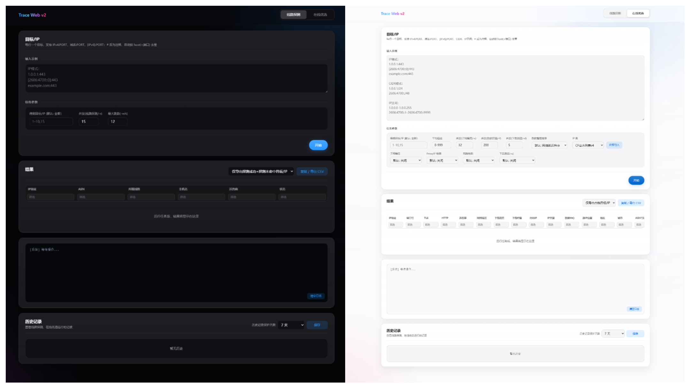

# Trace-Web
Trace-Web 是一个基于 Go 开发的 Cloudflare IP 线路匹配与在线优选工具



## 运行参数

| 参数 | 默认值 | 说明 |
|------|--------|------|
| `-f`/ `--file` | — | 导入测试目标/IP 的文件（*.txt） |
| `-o`/ `--output` | `result.csv` | 导出结果的 CSV 文件路径（必须为 .csv 后缀） |
| `-u`/ `--url` | `https://speed.cloudflare.com/__down?bytes=99999999` | 【在线优选】HTTPS 下载测速地址 |
| `-n`/ `--num` | `200` | 【在线优选】数据筛选并发 workers |
| `-d`/ `--download` | `5` | 【在线优选】下载测速并发 workers |
| `-w`/ `--worker` | `15` | 【线路匹配】线路匹配并发 workers（每 worker 独立 ICMP socket） |
| `-mh`/ `--max-hops` | `12` | 【线路匹配】最大跳数（失败重试阶段自动放宽至 25） |
| `-me`/ `--max-empty` | `8` | 【线路匹配】连续无响应跳数上限（重试阶段自动放宽至 12） |
| `-th`/ `--timeout-hop` | `500` | 【线路匹配】单跳超时（毫秒）（重试阶段自动放宽至 1000） |
| `-tt`/ `--timeout-total` | `60000` | 【线路匹配】单目标总超时（毫秒）（重试阶段自动放宽至 90000） |

## 使用方法

`tracev2.exe -h`

`netsh advfirewall firewall add rule name="All ICMP v4" dir=in action=allow protocol=icmpv4:any,any` # PowerShell / CMD 管理员运行

`netsh advfirewall firewall add rule name="All ICMP v6" dir=in action=allow protocol=icmpv6:any,any` # PowerShell / CMD 管理员运行

## 注意事项

**线路匹配** 单次上限 **65536** 个地址

**在线优选** 单次上限 **100000** 个地址

## 项目结构

```
├── tracev2.exe              # CLI 
├── trace_webv2.exe          # Web 端
└── data/
    ├── asn_prefixes.json      # RIPEStat → 线路识别
    ├── locations.json         # 白嫖哥 → Cloudflare 数据中心位置
    └── GeoLite2-ASN.mmdb      # MaxMind → ASN 数据库
```

## 项目参考（以下排名不分先后）
- [nxtrace/NTrace-core](https://github.com/nxtrace/NTrace-core)
- [cmliu/edgetunnel](https://github.com/cmliu/edgetunnel)
- [PoemMisty/CFData-WEB](https://github.com/PoemMisty/CFData-WEB)
- [e13815332/ASNIPtest](https://github.com/e13815332/ASNIPtest)

## 许可证
详见 [LICENSE](LICENSE)
